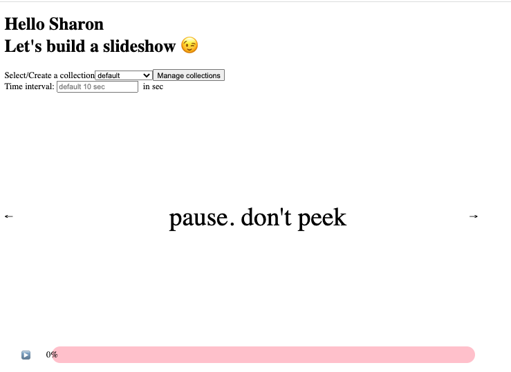
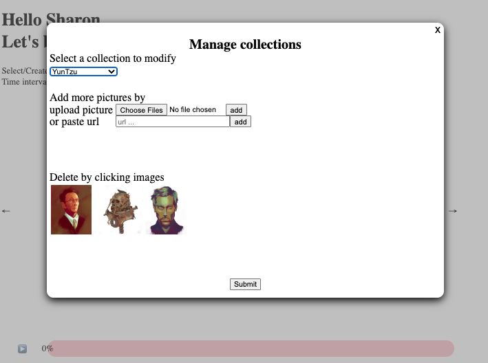
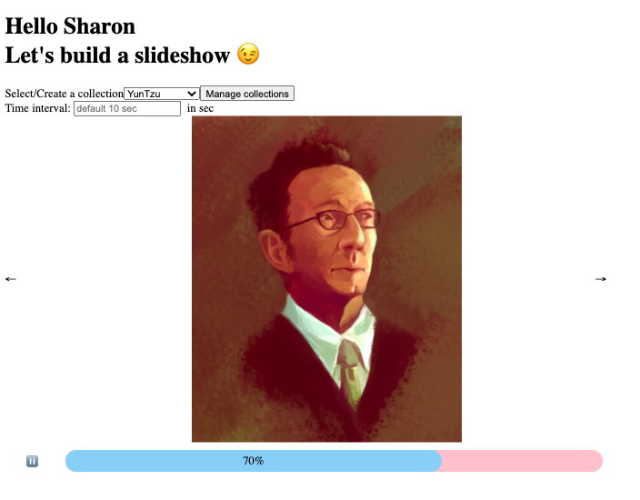
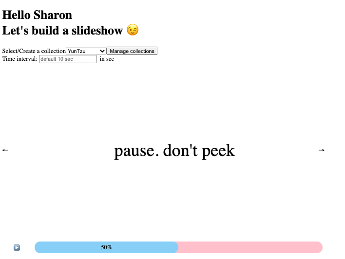

# myslideshow

Create a automatic slideshow with the user created collections. This app is built to help users to practice their sketching skills with time limit. Users are allowed to select, create, or modify the picture collections and adjust the duration of each picture. Users can also pause and resume the slideshow.

#### screenshots

&nbsp;&nbsp;&nbsp;

## Building and running on localhost

First install dependencies:

```sh
npm install
```

To create a production build:

```sh
npm run build-prod
```

To create a development build:

```sh
npm run build-dev
```

To start the server

```sh
npm run server-dev
```

## Credits

Made with [createapp.dev](https://createapp.dev/)
